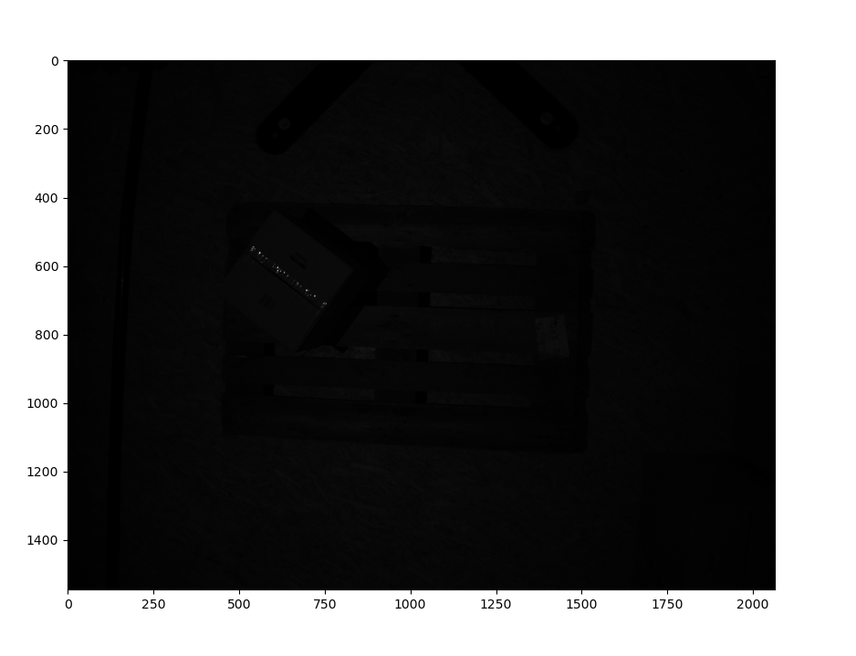
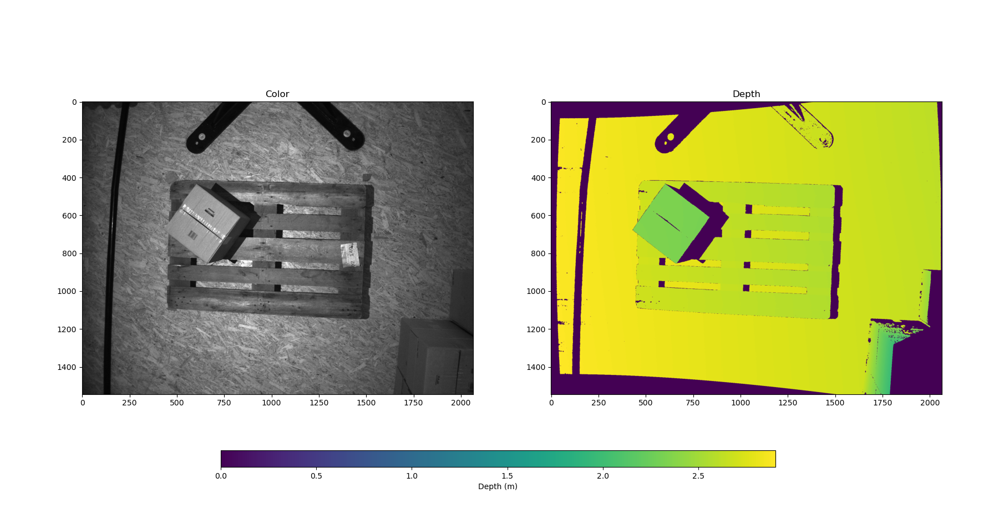
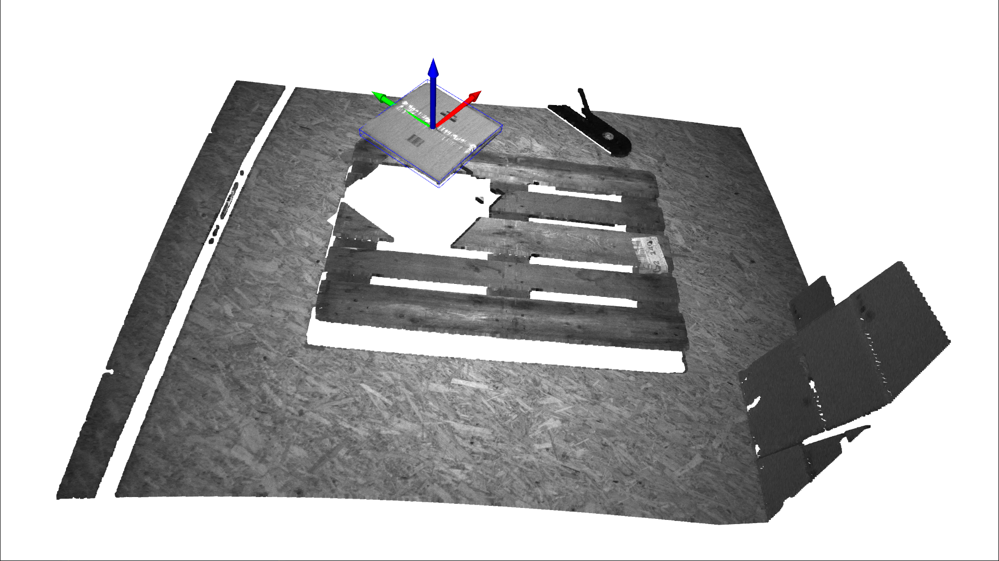

# Box Pose Estimation from Depth Map

This project implements a pipeline to estimate the 3D pose of a box-shaped object from a depth map, as required by Task II.

## Objective

Estimate the pose of a known box-shaped object using only depth and intensity images, and output the result as a 4×4 transformation matrix (camera-to-object frame).

## Provided Data

- `one-box.depth.npdata.npy` – depth map (in meters)
- `one-box.color.npdata.npy` – grayscale intensity image
- `intrinsics.npy` – camera intrinsic matrix (3×3)
- `extrinsics.npy` – camera-to-world transformation (4×4, with translation part in millimeters)

## Approach

The solution is based on [Open3D](http://www.open3d.org/) to build and process the point cloud and follows these steps:

1. All input data are loaded.

   - The `one-box.color.npdata.npy` file contains mostly intensity values within the `[0, 255]` range, with less than 1% exceeding that range.
   - These outliers significantly disrupt visualization, so values are clipped to `[0, 255]`.

2. An Open3D `RGBDImage` is constructed from the intensity and depth arrays.

   - The depth is provided in meters, while the translation component of the extrinsics is given in millimeters.
   - To ensure consistent units, the extrinsics translation is converted to meters before use.
   - The point cloud is then reconstructed using the camera intrinsics and the adjusted extrinsics. The obtained point cloud is espressed in the world frame.

3. The resulting point cloud is spatially cropped using a fixed 3D bounding volume to isolate the box and surrounding pallet area.

   - The cropping limits are selected to exclude irrelevant objects near the scene boundaries while retaining enough margin to tolerate variation in pallet positioning.
   - A threshold along the Z axis is also applied, to eliminate background points (e.g. the floor and pallet).
   - DBSCAN clustering is then used to segment the point cloud, and only the largest cluster is retained, assumed to be the top surface of the box.

4. A minimal oriented bounding box (OBB) is computed from the segmented point cloud.

   - The orientation and centroid of the OBB are used to construct a transformation matrix representing the pose of the box in the world frame.
   - This pose is then transformed into the camera frame using the inverse of the provided extrinsics.

5. For visualization:

   - The filtered intensity image and the depth image are shown side-by-side.
   - The OBB and the associated coordinate frame are overlaid on the original point cloud.


## Bonus II: Outlier Rejection

To enhance the robustness of the pose estimation, a two-stage filtering strategy is applied (as outlined earlier in step 3):

1. **3D cropping**: The point cloud is first cropped to a region of interest that contains the box and removes all surrounding background.

2. **Clustering**: DBSCAN is then applied to segment disconnected surfaces. Only the largest cluster is kept (assumed to be the top surface of the box), removing residual noise or small structures.

## Result

The final estimated pose is returned as a 4×4 matrix in the **camera frame**:

```python
Pose in 'world' frame:
 [-0.57124105  0.78788917  0.23003115  0.01993976]
 [-0.80414302 -0.59337747  0.03545684 -1.20502231]
 [ 0.16443136 -0.16472354  0.97253714 -0.63114266]
 [ 0.          0.          0.          1.        ]

Pose in 'camera' frame:
 [ 0.54850586 -0.76780292 -0.33108773 -0.10270557]
 [-0.80299399 -0.59409754  0.04742983 -2.34499626]
 [-0.23311489  0.23984669 -0.94240668  2.35396091]
 [ 0.          0.          0.          1.        ]
```
---

This is the raw grayscale intensity image (`one-box.color.npdata.npy`) before preprocessing.



---

This image shows the side-by-side view of the clipped grayscale image and the aligned depth map used to generate the RGBD input for Open3D.



---

This is the final reconstructed point cloud with the estimated OBB and the pose frame visualized.



---

A short video of the script execution is available here:

https://drive.google.com/drive/folders/1IHfW-iNBbZrm5FU5sDUWyizdXBu-KNx5?usp=sharing