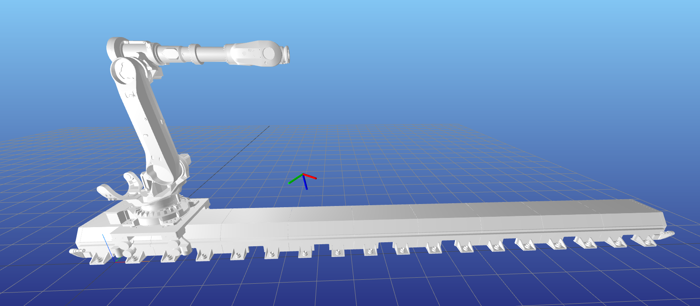
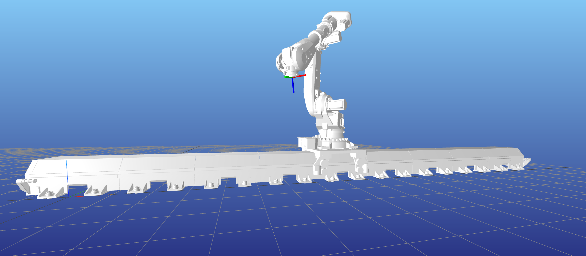
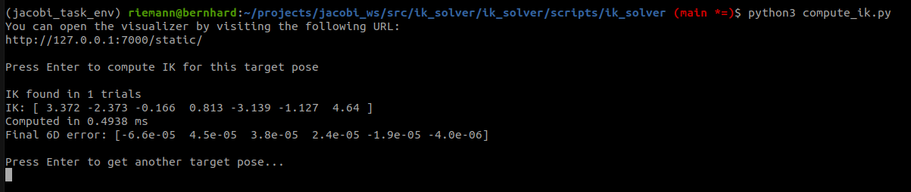

# Inverse Kinematics Solver for Robot on Linear Gantry

This project implements an inverse kinematics (IK) solver for a 6-axis ABB IRB 6700 industrial robot mounted on a linear axis gantry, as required by Task I.

## Objective

Compute a valid joint configuration that allows the robot to reach a desired end-effector pose in 3D space, taking into account the additional degree of freedom provided by the linear axis.

## Provided Data

- `ABB IRB 6700 URDF` – robot kinematic description  
- `Linear gantry URDF` – prismatic axis allowing horizontal translation of the robot base

## Approach

The core of the solution is implemented in C++ using the [Pinocchio](https://stack-of-tasks.github.io/pinocchio/) library, a fast and efficient framework for kinematic and dynamic computations on articulated systems.

The development followed these main steps:

- **URDF Preparation**  
  Since the robot and the linear axis must be considered as a single system, a unified URDF was generated (`jacobi_robot.urdf`).  
  First, the original URDFs were converted to `xacro::macro` format for modular composition.  
  They were then included and linked together using a fixed joint in the file `jacobi_robot.urdf.xacro`. The final urdf is created as follows:

  ```bash
  xacro jacobi_robot.urdf.xacro > jacobi_robot.urdf
   ```

  While merging the two URDFs manually would have been possible, this approach is more scalable and cleaner for future changes.  
  In addition, mesh files in the `collision/` folders were converted from `.gbl` to `.obj` format using an online tool, to ensure compatibility with Pinocchio's URDF parser.

- **C++ IK Solver**  
  A custom C++ class was developed to compute inverse kinematics for the combined robot + gantry system (details below).

- **Python Binding and Evaluation Script**  
  Python bindings were defined using `pybind11`.  
  A Python script was implemented to:
  - Generate random target poses
  - Call the IK solver
  - Visualize the robot and target pose using [Meshcat](https://github.com/meshcat-dev/meshcat)

  If the solver fails to converge within a maximum number of iterations, a new random seed is used (up to 20 times before reporting a failure).  
  In practice, very few iterations are usually sufficient.  
  The script also reports the time to solution, the result, and the final residual error.

> **Why use C++ instead of Pinocchio's native Python bindings?**  
> Since Task II was already implemented in Python, this task was intentionally developed in C++ to showcase both languages.

---

### IK Solver Design

A modular class `IKSolver` was developed to perform inverse kinematics on any `pinocchio::Model` (the robot kinematic and dynamic model).  
The solver is reusable across different robots and topologies.

The inverse kinematics algorithm used is **Closed-Loop Inverse Kinematics (CLIK)**. It is based on the differential relationship between joint velocities and the end-effector twist, expressed by the geometric Jacobian:

    𝑥̇ = J(q) · 𝑞̇

At each iteration, a joint velocity vector is computed to reduce the pose error, and the configuration is updated accordingly:

    𝑞̇ = -Jᵀ · (J · Jᵀ + λ · I)⁻¹ · e

    qₖ₊₁ = qₖ + 𝑞̇ · Δt

where:

- 𝑥̇ is the end-effector twist
- 𝑞̇ is the joint velocity
- J is the geometric Jacobian
- λ is a damping term (for numerical stability)
- e is the 6D pose error (twist, expressed in the end-effector frame)
- qₖ is the current joint configuration
- Δt is the integration time step
---

### Iteration Steps

1. **Forward kinematics**  
   Compute the current end-effector pose at the current joint configuration:

   ```cpp
   pinocchio::forwardKinematics(model_, data, ik); // at first iteration, ik is random  
   pinocchio::updateFramePlacements(model_, data);  
   const pinocchio::SE3& current_pose = data.oMf[frame_id];
   ```

2. **Pose error computation**  
   Express the target pose in the end-effector frame, and compute the 6D error as a twist:

   ```cpp
   const pinocchio::SE3 target_in_ee = current_pose.actInv(pose_target);  
   error_twist = pinocchio::log6(target_in_ee).toVector(); // project error on tangent space of SE(3)
   ```

3. **Jacobian computation and correction**

   ```cpp
   pinocchio::computeFrameJacobian(model_, data, ik, frame_id, J);  
   pinocchio::Jlog6(target_in_ee.inverse(), Jlog);  
   J = -Jlog * J; // compute the Jacobian of error_twist w.r.t. the joint configuration
   ```

4. **CLIK update rule**

   ```cpp
   JJt = J * J.transpose();  
   JJt.diagonal().array() += lambda;  
   dq = -J.transpose() * JJt.ldlt().solve(error_twist);  
   ik = pinocchio::integrate(model_, ik, dq * DT); // integrate dq over Δt
   ```

The iteration stops once the norm of `error_twist` falls below a defined threshold.

---

## Result
The solver returns a feasible configuration that reaches the target pose within a small numerical tolerance.

Example:

**Target pose to reach (randomly generated)**  


---

**IK solution**  


---

**Terminal output: solution, runtime, residual error**  


---

**Demo video**  
A short video of the script execution is available here:

https://drive.google.com/file/d/1xaiFWiuec8fmgdM8N9_YwydjuOV2z6pY/view?usp=sharing
