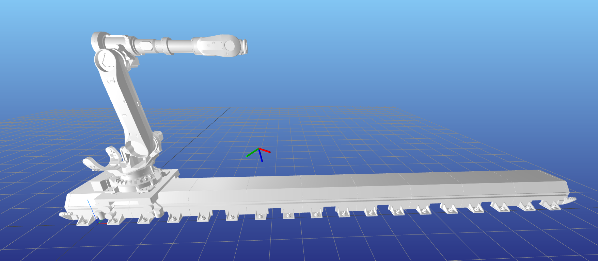

# Inverse Kinematics Solver for Robot on Linear Gantry

This project implements an inverse kinematics (IK) solver for a 6-axis ABB IRB 6700 industrial robot mounted on a linear axis gantry, as required by Task I.

## Objective

Compute a valid joint configuration that allows the robot to reach a desired end-effector pose in 3D space, accounting for the additional degree of freedom provided by the linear axis.

## Provided Data

- `ABB IRB 6700 URDF` – description of the robot kinematics
- `Linear gantry URDF` – prismatic axis allowing horizontal translation of the robot base

## Approach

The core of the solution is implemented in C++ using the [Pinocchio](https://stack-of-tasks.github.io/pinocchio/) library, a fast and efficient framework for kinematic and dynamic computations on articulated systems.

The work was subdivided in these steps:
 - Prepare the URDF. Since we need to consider the robot and the linear axis as one single system, a unified urdf has been generated (`jacobi_robot.urdf`). First, `ABB IRB 6700 URDF` and `Linear gantry URDF` where modified to be `xacro::macro` and be easily included into `jacobi_robot.urdf.xacro` and linked with a fixed joint. Then, the unified urdf was created with the command 
        ```xacro jacobi_robot.urdf.xacro > jacobi_robot.urdf```. 
    Despite a unified robot could be created by just copy-paste the two individual urdf in one file, this is a general approach that scale better and make modifications and organization of the work easier.
    Furthermore, collisions files in the folders `collision` were converted from `gbl` to `obj` file  using an online converter to be compliant with the Pinocchio urdf importer.
- A C++ class defining the IK solver was developed (more details below).
- The IK solver python bindings were defined. A python script that generates random pose target, runs the IK solver and display the pose target and the computed robot IK and pose was developed. Meshcat is used for visualizations. If the algorithm is not able to find a solution within the maximum number of iteration, it is executed again with another initial seed. This happens a max of `20` times before the algorithms reports a failure.
In the executed tests, generally very few iterations are needed to find a solution. Time to find the solution are reported as well as the solution found and the residual error.

Why did you develop python bindings instead of developing the IK solver with python, since Pinocchio already has python bindings? Because I had already developed Task II in python and I wanted to do C++ and Python both.

### IK Solver Design

A custom class `IKSolver` was developed to perform inverse kinematics on an arbitrary kinematic chain defined by a `pinocchio::Model`. The solver is general and modular, allowing reuse across different robots with minimal changes.

The inverse kinematics algorithm used is **Closed-Loop Inverse Kinematics (CLIK)**. It is based on the differential relationship between joint velocities and the end-effector twist, expressed by the geometric Jacobian:

    𝑥̇ = J(q) · 𝑞̇

At each iteration, a joint velocity vector is computed to reduce the pose error, and the configuration is updated accordingly:

    𝑞̇ = -Jᵀ · (J · Jᵀ + λ · I)⁻¹ · e

    qₖ₊₁ = qₖ + 𝑞̇ · Δt

where:

- 𝑥̇ is the end-effector twist
- 𝑞̇ is the joint velocity
- J is the geometric Jacobian
- λ is a damping term (for numerical stability)
- e is the 6D pose error (twist, expressed in the end-effector frame)
- qₖ is the current joint configuration
- Δt is the integration time step

At each iteration:

1. Compute the current pose of the end-effector, using the forward kinematic of the robot at current configuration.

   ```cpp
   pinocchio::forwardKinematics(model_, data, ik); // at the beginning ik is set random
   pinocchio::updateFramePlacements(model_, data);
   const pinocchio::SE3& current_pose = data.oMf[frame_id];
   ```
2. Express the target in the end-effector frame and compute the 6D error in the form of a twist:

    ```cpp
    const pinocchio::SE3 target_in_ee = current_pose.actInv(pose_target);
    error_twist = pinocchio::log6(target_in_ee).toVector(); // project the pose error to the tangent hyperplane of SE(3) in the current robot pose
    ```

3. Compute the Jacobian:

    ```cpp
    pinocchio::computeFrameJacobian(model_, data, ik, frame_id, J);
    pinocchio::Jlog6(target_in_ee.inverse(), Jlog); 
    J = -Jlog * J; // this compute the Jacobian of error_twist w.r.t. the robot joints
    ```
4. Compute the joints increment using the CLIK update rule:

    ```cpp
    JJt = J * J.transpose();
    JJt.diagonal().array() += lambda;
    dq = -J.transpose() * JJt.ldlt().solve(error_twist); // 𝑞̇ = -Jᵀ · (J · Jᵀ + λ · I)⁻¹ · e
    ik = pinocchio::integrate(model_, ik, dq * DT); // qₖ₊₁ = qₖ + 𝑞̇ · Δt
    ```

The iteration stops once `error_twist` falls below a minimum threshold.

## Result

The solver returns a feasible configuration that reaches the target pose within a small numerical tolerance.

Example:

This is the random target pose to reach



---

This is the IK solution


---

This is the terminal output with solution, time to solve and residual error


---

A short video of the script execution is available here:

https://drive.google.com/file/d/1xaiFWiuec8fmgdM8N9_YwydjuOV2z6pY/view?usp=sharing
